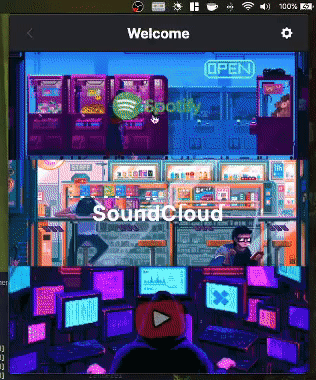

# music-menubar 


[](https://www.buymeacoffee.com/aaronbleop)

tldr; a dropdown media controller for your youtube playlists / videos, written in TypeScript (React + Electron) and using Tailwind CSS.

I'm always trying to create things to help improve my workflow, and while this app may only be a small improvement, it is more than enough for me.

<p align="center">
  
</p>

## Installation & Startup

You will need to configure a `.env` file according to the provided example: `.env.example`. Once created, run the following commands:

```bash
yarn
yarn dev
```

## Current state

Currently this media player is only capable of managing existing YouTube playlists, videos and streams. A local library functionality is early in development, as well. This will allow you to load in local media files as you would any traditional media player.

I noticed that electron menubar apps don't play nicely with tiling managers (like what I have on my linux machine) and so I have plans to add a TUI variant of this application sometime in the future, but not anytime soon.

Please refer to the [issues](https://github.com/aaronleopold/music-menubar/issues) page for information about any current bugs, feature requests, etc.

## Usage

Off the bat, this will come preloaded with three playlists and one stream. All of the preloaded items are Lofi, so if that's not your thing you can just delete them. To link new items, all that is required is pasting an appropriate link and assigning a name.

In the event that the URL parsing fails, you'll need to grab the ID from the URL manually. For playlists, this is the value that comes immediately after `?list=`, and for videos / streams this is the value that comes immediately after `?v=`.

For example, let's say you wanted to add the following playlist:

`https://www.youtube.com/playlist?list=PLm5pKYShxnXB1g2LixFdKxjAvl3P2O4Hm`

The ID to extract here is: `PLm5pKYShxnXB1g2LixFdKxjAvl3P2O4Hm`

Now, lets say you wanted to now add this video:

`https://www.youtube.com/watch?v=rCFmLjGq3Jg`

The ID to extract here is `rCFmLjGq3Jg`.

## Artwork

I used a large amount (and still increasing) of gifs in the electron application, and none of it is mine. Zip. Nada. All of the art you see is thanks to other people who have amazingly great talent, and the attribution information is located at [`packages/electron/src/renderer/assets/attribution.md`](https://github.com/aaronleopold/music-menubar/blob/main/src/renderer/assets/attribution.md)

## Contributing

If you would like to contribute, please refer to the [CONTRIBUTING.md](https://github.com/aaronleopold/music-menubar/blob/main/CONTRIBUTING.md) for more information
